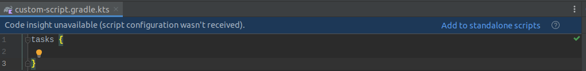
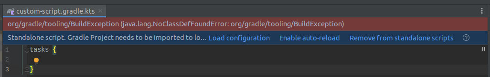

* `git clone https://github.com/Ic-ks/build-script-error-example.git`
* IntelliJ: `New->Project from Existing Sources...` 
* choose `build-script-error-example`
* choose `import project from external model` select gradle
* open `example-sub-project/custom-script.gradle.kts`

* press `add to standalone scripts`
* error occurs

